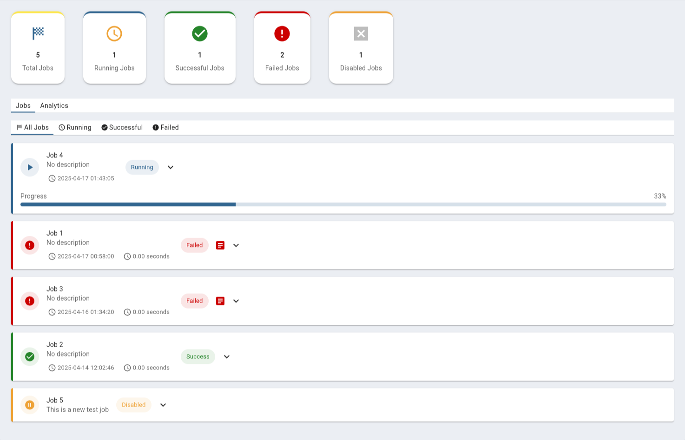

# Real-Time Job Status & Alerting System for pgAdmin4 + pgAgent

A powerful enhancement for **pgAdmin4** that enables real-time updates for **pgAgent job status**, **email alerting**, and **interactive job monitoring**, powered by **Socket.IO**, **PostgreSQL NOTIFY**, and **custom job subscriptions**.

## Overview

This module enhances pgAdmin's job management capabilities by:
- Listening to **PostgreSQL NOTIFY events**
- Sending **instant browser updates** using **Socket.IO**
- Dispatching **email alerts** via **libcurl SMTP**
- Letting users **subscribe only to selected jobs** for notifications
- Providing **interactive job monitoring** through a modern React-based dashboard

---

## Architecture Overview

> Real Time Job Status Workflow :  


### Workflow Steps:
1. **Connection Initialization**
   - pgAdmin client initiates Socket.IO connection
   - Registers for job status monitoring
2. **Real-Time Listening**
   - Background thread subscribes via `LISTEN`
   - PostgreSQL sends notifications
3. **Client Updates**
   - Receives status change
   - Updates UI dynamically
4. **Connection Management**
   - Keep-alive pings every 30s
   - Auto-reconnect support

---

## 🔧 Core Components

### 1. Job Monitor Dashboard (React)

**Key Features:**
- Real-time job status visualization
- Interactive charts and statistics
- Advanced filtering capabilities
- Detailed job logs and analytics

```javascript
// Socket connection setup
useEffect(() => {
  if (!sid || !pageVisible) return;
  const setupSocket = () => {
    try {
      const pgaJobNode = pgAdmin.Browser.Nodes['pga_job'];
      // Socket initialization and event handling
      const onJobStatusUpdate = async (data) => {
        // Handle job status updates
      };
    } catch (error) {
      console.error('[JobMonitor] Error setting up socket:', error);
    }
  };
  setupSocket();
}, [sid, pageVisible]);
```

**Statistics Dashboard:**
```javascript
const renderJobStats = () => {
  return (
    <Grid2 container spacing={5}>
      <StatCardItem 
        title={gettext('Total Jobs')} 
        value={summary.total_jobs || 0} 
        status="total" 
        icon={<SportsScoreIcon color="primary" />}
      />
      // ... other stat cards
    </Grid2>
  );
};
```

### 2. Socket.IO Server (Python)

📄 [`__init__.py`](pgadmin4/web/pgadmin/browser/server_groups/servers/pgagent/__init__.py)

**Key Features:**
- `/pgagent` namespace
- Keeps track of connected clients and active job listeners
- Handles:
  - `connect`, `disconnect`
  - `start_job_status_listener`, `stop_job_status_listener`

```python
@socketio.on('start_job_status_listener', namespace='/pgagent')
def start_job_status_listener(sid, client_sid):
    ...
    loop = asyncio.new_event_loop()
    asyncio.set_event_loop(loop)
    loop.run_until_complete(check_notifications(app, sid, client_sid))
```

** Async Notification Polling:**
```python
async def check_notifications(app, sid, client_sid):
    conn = await psycopg.AsyncConnection.connect(...)
    await conn.execute("LISTEN job_status_channel;")
    ...
```

---

### 3. Frontend Integration (JavaScript)

📄 [`pga_job.js`](pgadmin4/web/pgadmin/browser/server_groups/servers/pgagent/static/js/pga_job.js)
📄 [`pga_job.ui.js`](pgadmin4/web/pgadmin/browser/server_groups/servers/pgagent/static/js/pga_job.ui.js)
📄 [`JobMonitor.jsx`](pgadmin4/web/pgadmin/dashboard/static/js/JobMonitor.jsx)


**Features:**
- Real-time event updates from server
- Dynamic UI rendering
- Auto-reconnect + keep-alive ping

```javascript
connectJobStatusSocket: function(serverId) {
  this.socket = io("/pgagent");
  this.socket.emit("start_job_status_listener", { sid: serverId });
}
```

```javascript
startKeepAlivePing: function() {
  setInterval(() => {
    this.socket.emit("keep_alive");
  }, 30000);
}
```

---

### 4. 📬 Email Notification Module (C++)

📄 [`notification.cpp`](pgagent/notification.cpp)

**Features:**
- Sends email alerts on job status change
- SMTP config via environment variables
- Batches alerts to avoid spam

```cpp
void SendEmail(const std::string &subject, const std::string &body) {
  curl_easy_setopt(curl, CURLOPT_USERNAME, getenv("SMTP_USER"));
  curl_easy_setopt(curl, CURLOPT_PASSWORD, getenv("SMTP_PASS"));
  ...
}
```

**Buffering:**
```cpp
std::vector<std::string> emailBuffer;
#define MAX_BUFFER_SIZE 250
#define TIME_LIMIT_SEC 120
```

---

### 4. Custom Job Subscription System

📄 [`pga_job.ui.js`](https://github.com/DKS2301/pgAgent-Miniproject/blob/main/Real%20Time%20Job%20Status%20and%20Alerting/pgadmin4/web/pgadmin/browser/server_groups/servers/pgagent/static/js/pga_job.ui.js) + integrated in JS and Python

**Feature:**
Let users select **which jobs** they want to get notifications for.

**Client-side Job Selector (JavaScript):**
```javascript
toggleJobAlertSubscription: function(jobId, isSubscribed) {
  this.socket.emit("update_job_subscription", {
    job_id: jobId,
    subscribe: isSubscribed,
    server_id: currentServerId
  });
}
```

**Server-side Subscription Handling (Python):**
```python
@socketio.on("update_job_subscription", namespace="/pgagent")
def handle_job_subscription(data):
    server_id = data['server_id']
    job_id = data['job_id']
    ...
    if data['subscribe']:
        subscriptions[server_id].add(job_id)
    else:
        subscriptions[server_id].discard(job_id)
```

**C++ Notification Trigger (Only for Subscribed Jobs):**
```cpp
if (isSubscribed(job_id)) {
  NotifyJobStatus(job_id, status);
}
```

---

## User Interaction Guide

### 1. Job Monitoring Dashboard
- **Real-time Updates**: View live job status changes
- **Statistics**: Monitor job counts and success rates
- **Charts**: Analyze trends through interactive visualizations
- **Filtering**: Customize views by status, time, and specific jobs

### 2. Alert Management
- **Email Notifications**: Configure and receive alerts
- **Job Subscriptions**: Select specific jobs for monitoring
- **Status Tracking**: Monitor job progress and failures

### 3. Data Analysis
- **Historical Data**: View past job performance
- **Trend Analysis**: Identify patterns and issues
- **Log Access**: Review detailed execution logs

---

## How to Test the Setup

### 1. Prerequisites
- PostgreSQL configured with pgAgent schema
- pgAdmin4 built from this modified version
- Python dependencies: `Flask`, `Flask-SocketIO`, `psycopg[binary]`
- C++ libraries: libcurl
- React dependencies: Material-UI, Chart.js, Socket.io-client

### 2. Set Environment Variables

```bash
export SMTP_HOST="smtp.gmail.com"
export SMTP_PORT="587"
export SMTP_USER="your-email@gmail.com"
export SMTP_PASS="your-password"
```

### 3. Run and Monitor

1. Launch pgAdmin and pgAgent
2. Navigate to the Job Monitor dashboard
3. Configure job subscriptions
4. Monitor real-time updates
5. Review email notifications

---

## ✨ Screenshots
### Job Monitor Dashboard


### Custom Subscription to Jobs


### Real-time UI status change


### Alert Email Example


### Job Monitor Dashboard



### Analytics


---

## Implementation Details

### Server-Side Thread Management

```python
def start_job_status_listener(app, sid, client_sid):
    ...
    loop.run_until_complete(check_notifications(app, sid, client_sid))
```

### Subscription-Aware C++ Notify

```cpp
if (UserHasSubscribed(job_id)) {
    NotifyJobStatus(job_id, "FAILED");
}
```

---

## Error Handling Strategy

| Component     | Failure Case                 | Mitigation                |
|---------------|------------------------------|---------------------------|
| SMTP Email    | Auth / Send failure          | Retry + Buffer            |
| Socket.IO     | Drop / Timeout               | Auto reconnect            |
| PostgreSQL    | Notify lost / timeout        | Periodic polling fallback |
| System Load   | Thread starvation / overload | Thread pool + cleanup     |

---

## Security Measures

- Environment variables for SMTP auth
- WebSocket session protection
- Validation of job IDs and server IDs
- Safe SQL and async DB usage
- Thread isolation & logging

---

## 🚀 Future Enhancements

- Retry failed jobs from UI
- View job logs directly
- Dashboard for job trends & failures
- Enhanced chart customization
- Dark mode support
- Export functionality for logs and charts

---

## 🧪 Testing Matrix

| Type           | Coverage                                 |
|----------------|------------------------------------------|
| Manual         | Full UI + Email trigger flow             |
| Unit Tests     | Socket.IO events, subscription logic     |
| Integration    | PostgreSQL NOTIFY + Socket pipeline      |
| Load Testing   | Email batching + async listener stability|

---

## 📚 Dependencies

| Type     | Packages/Libs                 |
|----------|-------------------------------|
| Backend  | Flask-SocketIO, psycopg, asyncio |
| C++ Core | libcurl, nlohmann/json, Boost |
| Frontend | React, Material-UI, Chart.js, Socket.io-client |

---

## ✅ Conclusion

This enhancement introduces **real-time**, **customizable**, and **secure job monitoring** to pgAdmin, empowering users with **proactive alerts** and **live UI feedback** for smoother devops and database workflows.

---

## 📂 Folder Structure

```
Real-Time-Job-Status-and-Alerting/
├── pgagent/                   # C++ source for pgAgent
│   ├── pgAgent.cpp
│   ├── subscription.cpp
├── pgadmin4/web/pgadmin/
│   └── browser/server_groups/servers/pgagent/
│       ├── __init__.py       # Python backend w/ socket server
│       └── static/js/
│           ├── pga_job.js    # JS client-side handler
│           └── job-monitor/  # React components
├── images/                   # Screenshots
├── README.md
```

---

## Contributing

We welcome contributions to enhance the Job Monitor component. Please follow these guidelines:
1. Fork the repository
2. Create a feature branch
3. Submit a pull request with detailed description

## License

This component is part of pgAdmin 4 and is released under the PostgreSQL License.